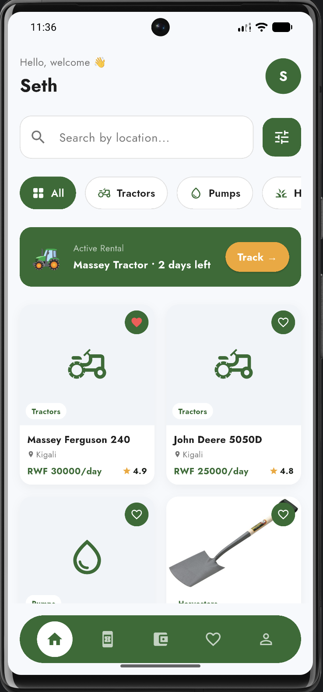
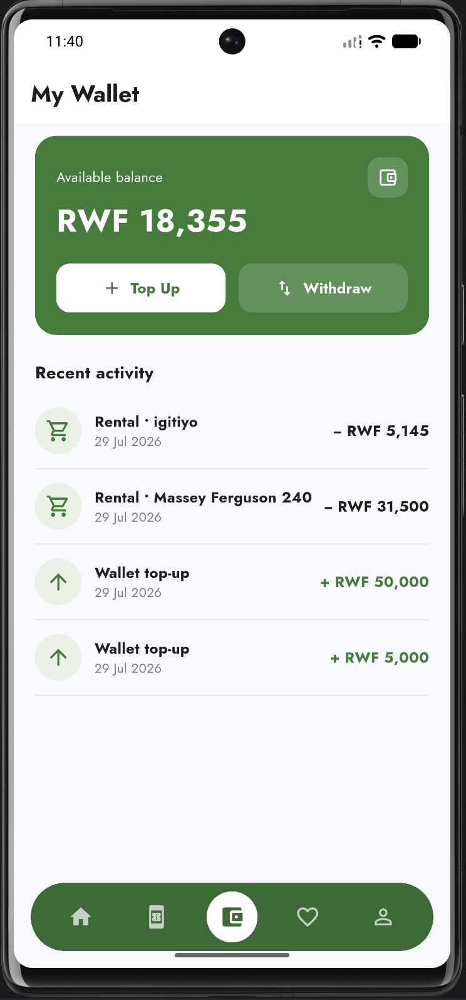
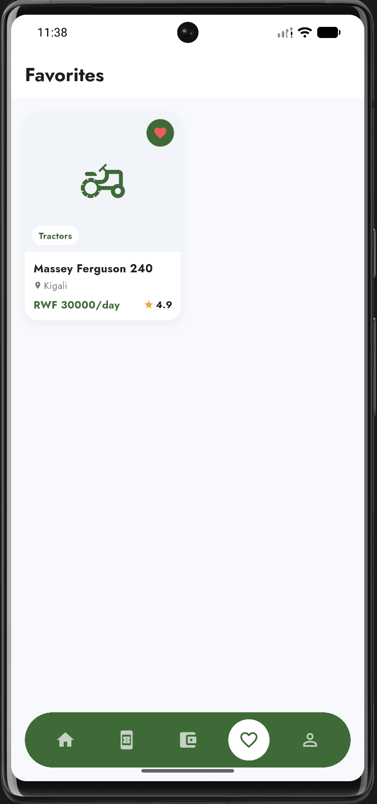
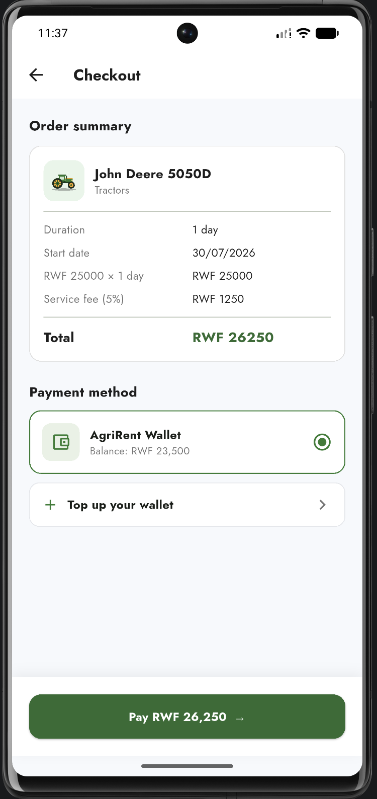
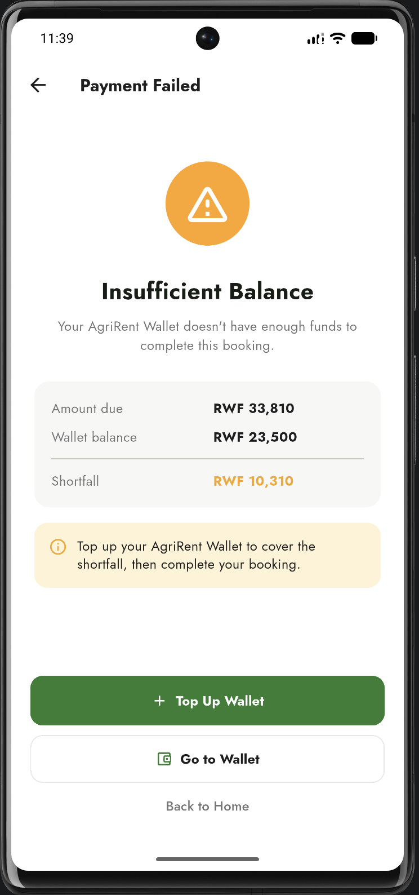
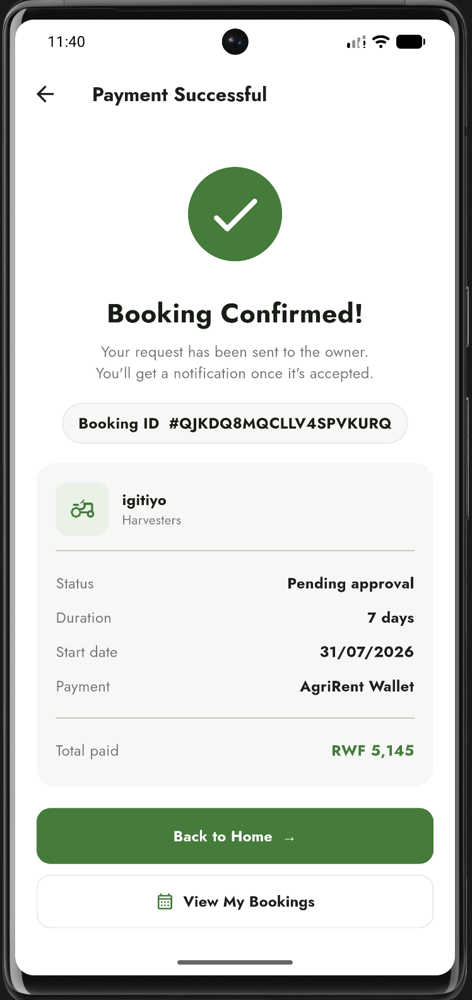
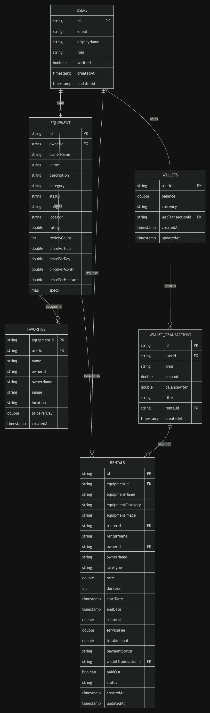
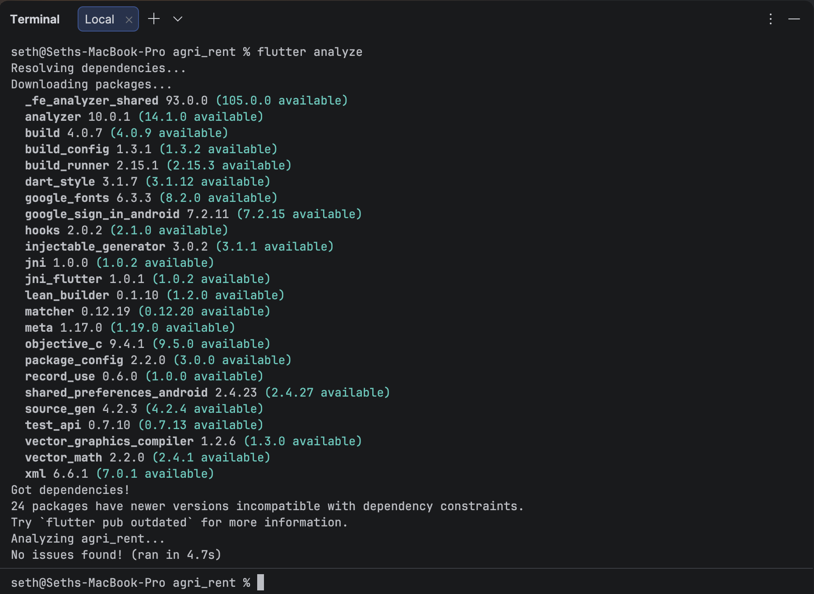
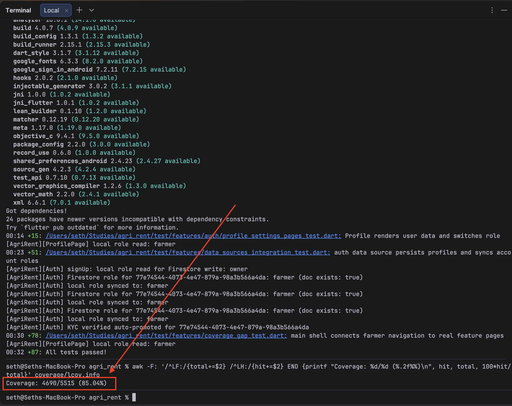

# AgriRent

AgriRent is a Flutter and Firebase marketplace that connects farmers who need
agricultural equipment with verified equipment owners. Farmers can discover
equipment, save favorites, fund an AgriRent Wallet, pay for a booking, and track
its status. Owners can publish listings and accept or decline incoming rental
requests.

## Product preview

The images below show the implemented application running against the
Firebase-backed feature flows. Full-resolution captures are kept in
`docs/screenshots`.

| Farmer dashboard | Wallet | Saved equipment |
| :---: | :---: | :---: |
|  |  |  |

| Checkout | Insufficient balance | Payment successful |
| :---: | :---: | :---: |
|  |  |  |

## How the app works

### Farmer journey

1. A farmer signs in with email/password or Google and browses equipment loaded
   from Firestore.
2. Tapping a heart writes the selected equipment to
   `users/{farmerId}/favorites/{equipmentId}`. The Favorites tab listens to that
   collection in real time, so saved items appear immediately.
3. The farmer chooses a rental rate and period. AgriRent calculates the subtotal,
   service fee, and final amount.
4. Checkout displays the live balance from `wallets/{farmerId}`.
5. Payment runs as one Firestore transaction. It verifies the latest balance,
   deducts the charge, creates an immutable wallet ledger entry, and creates the
   paid rental. If the balance is too low, none of those writes are committed.
6. The booking appears in My Bookings and continues to receive real-time status
   updates.

### Equipment-owner journey

1. An owner signs in with a verified owner account.
2. The owner creates and manages equipment listings.
3. Incoming paid rental requests appear in the owner dashboard.
4. The owner can accept or decline a pending request. Both parties see the
   updated status from Firestore snapshots.

There is no runtime seed-data or mock-data layer. Production screens read and
write Firebase Authentication and Cloud Firestore. In-memory Firebase fakes are
used only inside automated tests.

## Architecture

The project uses feature-first Clean Architecture with BLoC/Cubit state
management:

```text
lib/
├── core/                    # Theme, shared services, errors, utilities
├── features/
│   ├── auth/                # Firebase authentication and profiles
│   ├── equipment/           # Equipment discovery
│   ├── booking/             # Rental request and wallet checkout
│   ├── bookings/            # Farmer/owner booking history and actions
│   ├── favorites/           # Persistent Firestore favorites
│   ├── wallet/              # Balance, top-up, activity ledger
│   ├── owner/               # Owner listings and dashboard
│   ├── home/                # Farmer discovery UI
│   └── main_shell/          # Farmer tab navigation
├── firebase_options.dart
├── injection_container.dart
└── main.dart
```

Most data-backed features contain three layers:

- `domain`: entities, repository contracts, and business rules.
- `data`: Firebase data sources, models, and repository implementations.
- `presentation`: pages, widgets, and BLoC/Cubit state.

Dependencies point inward toward the domain layer. GetIt and Injectable connect
the concrete Firebase implementations at the application boundary.

## Firebase data model

| Path | Purpose |
| :--- | :--- |
| `users/{uid}` | Account profile, role, and owner-verification state. |
| `users/{uid}/favorites/{equipmentId}` | A farmer's saved equipment snapshot. |
| `equipment/{equipmentId}` | Owner listing, price, availability, image, and location. |
| `rentals/{rentalId}` | Paid booking, dates, parties, amount, payment link, and status. |
| `wallets/{uid}` | Current balance and currency for one authenticated user. |
| `wallets/{uid}/transactions/{transactionId}` | Immutable top-up or rental-payment ledger record. |

The authoritative security policy is in `firestore.rules` and is referenced by
`firebase.json`. Important guarantees include:

- users can access only their own wallet and favorites;
- listing writes require the correct owner identity;
- favorites cannot be written on behalf of another user;
- wallet payment, ledger creation, and rental creation must agree in the same
  atomic commit;
- rental participants have different, restricted status-transition powers; and
- unmatched Firestore paths are denied.

The complete deployment policy is available in
[`firestore.rules`](firestore.rules).

## Firestore entity-relationship diagram

The diagram presents the core Firestore entities, their key fields, and the
relationships used by the application. Favorites are stored below users, while
wallet transactions are immutable ledger records below wallets.

<a href="docs/diagrams/firestore-erd.jpg">
  
</a>

Click the diagram to open the full-resolution version.

## Wallet behavior

The wallet screen shows the live RWF balance and recent ledger activity. A
top-up creates a transaction entry and updates the balance atomically. Checkout
repeats its balance check inside the Firestore transaction, so two overlapping
bookings cannot both spend the same funds.

The current top-up screen is a coursework payment simulation: it records funds
directly in Firestore after user confirmation. A production release must move
top-up settlement to a trusted backend or Cloud Function that verifies a real
mobile-money/payment-provider callback before crediting the wallet. Withdrawals
also require that provider-backed server workflow and are intentionally not
credited or debited by the client.

## Technology

- Flutter and Dart
- Firebase Authentication
- Cloud Firestore
- BLoC/Cubit (`flutter_bloc`)
- GetIt and Injectable
- Equatable
- Flutter widget, golden, and Firebase integration tests

## Getting started

### Prerequisites

- Flutter compatible with Dart `^3.10.8`
- a Firebase project with Authentication and Firestore enabled
- Android Studio/Xcode or a supported web browser

### Run locally

```bash
flutter pub get
dart run build_runner build --delete-conflicting-outputs
flutter run
```

The repository contains generated Firebase platform options for the configured
course project. For a different Firebase project, run FlutterFire configuration
and add the platform-specific Firebase configuration files before launching.
Deploy the checked-in Firestore rules before testing authenticated writes:

```bash
firebase deploy --only firestore:rules
```

Do not deploy rules to a shared project without reviewing the selected Firebase
project first.

## Testing and quality gates

```bash
flutter analyze
flutter test --coverage
flutter build apk --debug
```

Validated on July 29, 2026:

- static analysis: no issues;
- automated tests: **87 passed**, covering units, repositories, in-memory
  Firebase integration, widgets, navigation, and golden screenshots;
- line coverage: **85.04%** (**4,690 / 5,515** executable lines); and
- Android debug APK build: successful.

## Reports and verification evidence

The terminal captures below provide the final static-analysis and automated-test
evidence. Click either image to open the full-resolution result.

| Flutter analysis | Tests and line coverage |
| :---: | :---: |
| <a href="docs/reports/flutter_analyze.png"></a> | <a href="docs/reports/flutter_coverage.png"></a> |
