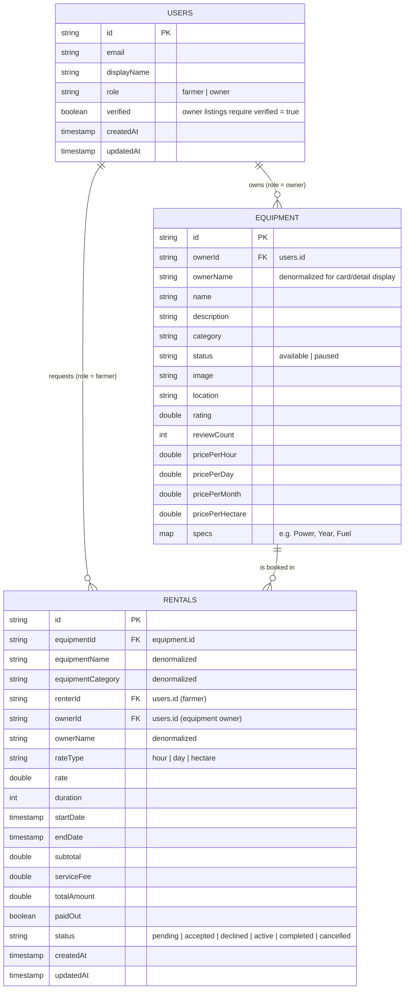

# AgriRent — Entity-Relationship Diagram

Matches the Cloud Firestore collections implemented in `lib/features/*`.
Both Farmers and Owners are stored in the same `users` collection,
distinguished by `role` — mirroring the Role Selection screen and avoiding a
redundant second collection for what is otherwise an identical account shape.

## Notes

- **`users` collection**: written by the auth data layer
  (`AuthRemoteDataSourceImpl`) at sign-up and on a user's first Google
  sign-in, using the role already chosen locally via `PreferencesService`.
  Regular sign-ins merge `email`/`displayName`/`updatedAt` only, without
  touching `role`, so a returning user's role is never silently overwritten.
  `photoUrl` intentionally isn't stored here — it's read directly from
  Firebase Auth (`user.photoURL`) where it already lives.
- **Security rules already deployed** (Console-managed, not yet in the repo
  as a `firestore.rules` file) gate this tightly: a user may only create
  their own profile, must arrive with `verified: false`, and can never set
  `verified` themselves — only a future admin action can flip it to `true`.
  `isVerifiedOwner()` (role == owner && verified == true) is required before
  an equipment listing can be created, which is what actually enforces "only
  verified owners can modify their listings" from Task 4's brief.
- **Known limitation**: some of Task 1's seeded `equipment` documents have
  `ownerId` set to a display name (e.g. `"Eric N."`) instead of a real
  `users` document ID — a leftover from manual test-data seeding before the
  `users` collection existed. New equipment created after this fix should
  reference a real `users.id`. Flagged here for the report's "Known
  Limitations and Future Work" section rather than silently patched, since
  fixing the seed data isn't this feature's responsibility.
- **Denormalization**: `ownerName`/`equipmentName`/`equipmentCategory` are
  copied onto `equipment` and `rentals` documents so list/detail screens
  (Home, My Bookings, Rental Requests) can render without an extra read per
  item. Source of truth for the owner's name stays on `users`; source of
  truth for equipment stays on `equipment`.
- **`rentals.status`** starts at `pending` on create (Task 3 — this feature).
  Task 5 (Booking Operations) transitions it to `accepted`/`declined`/
  `active`/`completed` via Firestore Update, and a farmer may only move a
  still-`pending` request to `cancelled` — all enforced server-side (see
  below), not just in the client.
- **Pricing**: `pricePerHour` and `pricePerHectare` are optional (default
  `0.0`/unset) — only `pricePerDay` is required on every listing, matching
  Task 1's original schema. The rental-rate selector only offers rates the
  owner has actually priced.
- **Collection is named `rentals`, not `bookings`**: the app's own domain
  vocabulary (`Booking` entity, `farmerId`, `total`) stays as-is internally,
  but `BookingModel` translates to/from the wire format the deployed
  security rules actually expect — `renterId`, `totalAmount`, `endDate`,
  `paidOut`. This mismatch caused a real `PERMISSION_DENIED` error the first
  time this feature was tested against the real rules (rather than a
  permissive/no-op ruleset), since anything not matching `/rentals/{id}`
  falls through to the rules' final `match /{document=**} { allow read,
  write: if false; }`. Fixed by aligning the model's `toJson`/`fromFirestore`
  to that schema instead of changing the rules.
- **Security rules already deployed** (Console-managed, not yet committed to
  the repo as a `firestore.rules` file — worth adding before submission) are
  considerably stricter than "authenticated users only": `rentals` creates
  require `renterId == request.auth.uid`, a fixed set of fields with correct
  types, `status == 'pending'`, `paidOut == false`, and `createdAt ==
  request.time`; updates are restricted to changing only `status`/
  `updatedAt`, and only by the rental's own owner or renter.
- **Known gap for Task 4**: the `equipment` collection's create rule also
  requires `bookingCount == 0` on every new listing, but the current
  `Equipment` entity/model has no `bookingCount` field at all. Whoever builds
  the "Add New Equipment" form will hit the same class of `PERMISSION_DENIED`
  this note above describes, unless that field is added first.
